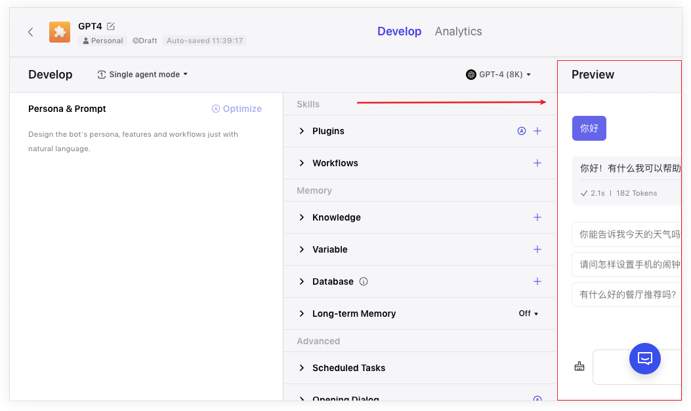

# X-Coze: 帮你一键美化 Coze，让 Bot 调试更丝滑。

## 🤖 简介

Coze 是字节跳动推出的 AI 聊天机器人与应用程序开发平台，类似于字节跳动版的 GPTs。

Coze 还加入了插件、知识、工作流、长期记忆和定时任务等增强聊天机器人能力和交互体验的功能。

## 👨‍💻 问题

Coze 非常好用，然而美中不足的是 Coze 的前端页面最小宽度为 1280px，这对小尺寸屏幕并不友好：

最右侧的 Bot 预览界面将无法完全显示，降低了使用体验和调试效率。

## ✅ 解决方案

为此，X-Coze 插件提供了一个「禅模式」的功能：

让 Bot 预览界面可以全屏使用，同时隐藏其他无关元素，让你沉浸式，无干扰地调试你的 Bot，提高调试效率。

## 🚨 免责声明

> 此扩展中 Coze 相关的图片资源（包括但不限于应用图标，演示图片等）来自网络，侵删。

您选择使用此扩展工具，即表明您自愿承担使用它所带来的所有后果和相关责任。这款扩展工具的初衷仅为教育和学习如何编写网页扩展程序，严禁将其用于商业用途，或者任何违反法律法规的行为。在使用这款扩展工具时，请您务必谨慎行事，并充分理解使用这款工具可能带来的风险。
